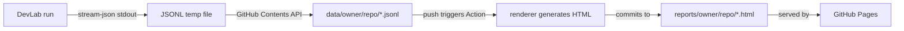

# DevLab Reports

Audit trail for DevLab agent runs. Full conversation JSONL is pushed here automatically, rendered to HTML via GitHub Action, and served on GitHub Pages.

## How It Works



- **DevLab** runs `claude --output-format stream-json --verbose`, saves full conversation to a temp file
- **reports.py** pushes the JSONL to `data/{owner}/{repo}/{timestamp}_{task}.jsonl` via GitHub API
- **GitHub Action** detects new JSONL, runs the renderer, commits HTML to `reports/`
- **GitHub Pages** serves `index.html` (repo picker) and `runs.html` (run list) which link to rendered reports

## Setup

### 1. Enable GitHub Pages

Already enabled on `main` branch, root `/`. If re-creating this repo:

```bash
gh api repos/kimwwk/devlab-reports/pages -X POST \
  -f "build_type=legacy" -f "source[branch]=main" -f "source[path]=/"
```

### 2. DevLab configuration

No config changes needed. DevLab automatically publishes reports when `GITHUB_TOKEN` is available (or `gh auth` is configured). The target repo is hardcoded in `src/devlab/reports.py`:

```python
REPORTS_REPO = "kimwwk/devlab-reports"
```

### 3. Renderer dependencies

Only needed if running locally:

```bash
pip install -r requirements.txt  # jinja2
python -m renderer.generate_report <file.jsonl> [output_dir]
```

## Repo Structure

```
data/                          # JSONL files (pushed by DevLab)
  └── {owner}/{repo}/*.jsonl
reports/                       # Rendered HTML (committed by Action)
  └── {owner}/{repo}/*.html
renderer/                      # Report generator
  ├── html_generator.py        # JSONL → HTML (auto-detects format)
  ├── message_parser.py        # stream-json adapter + data extraction
  ├── generate_report.py       # CLI entry point
  └── templates/               # Jinja2 templates + CSS + JS
index.html                     # GitHub Pages: repo picker
runs.html                      # GitHub Pages: run list
```
